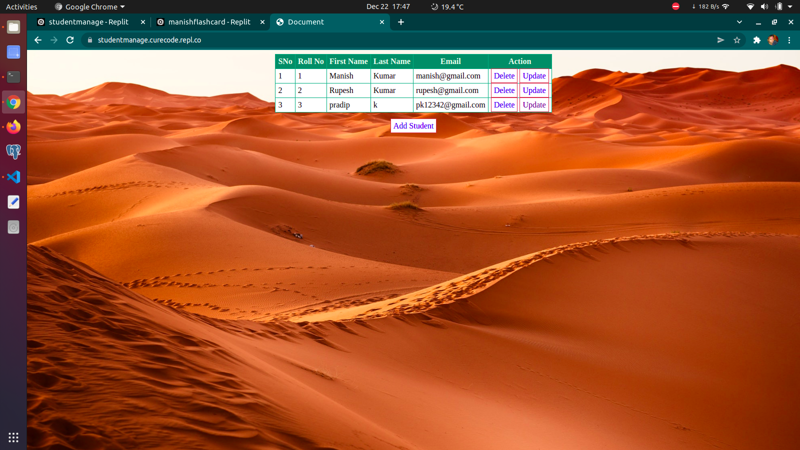

### Student Management Basic
#### Technology used
- HTML : Markup
- CSS : Style the markup
- Python : Backend Programming
- flask : As a Backend framework to manage server
- jinja : As a web template engine for the Python
- SQLite : Database to store data
- sqlite3 module : A Driver to connect SQLite database with flask
#### Technical details
##### Run from terminal
- Open terminal
- ```python3 main.py```
###### Remarks
- Check your python version ```python --version```
   - If you have python 2.x.x , then type python2 main.py
- You should have flask installed
   -  ```flask --version```
   -  If not then install, ```pip install flask```
   -  Specific version of flask will be installed which is compitible with intsalled version of python
##### Run from own server
- This is compitible with any server that supports python and flask,jinja
#### More about the project
- You can manage student details
- This is just a basic template, so it can be enhanced according to the requirements
- Live link : [Go](https://studentmanage.curecode.repl.co/)
- Screenshot: 
